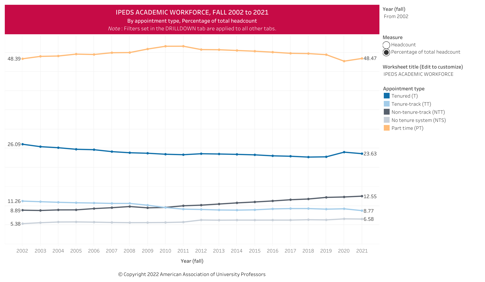
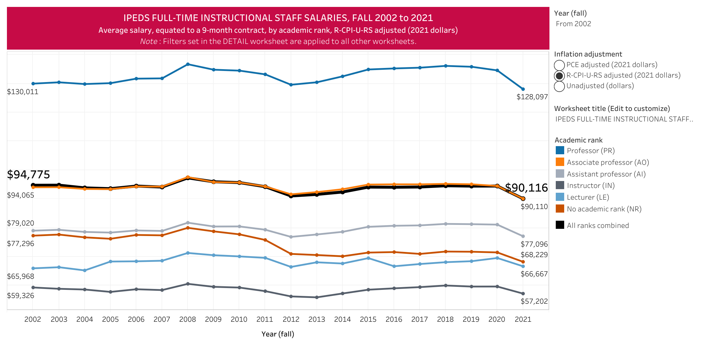
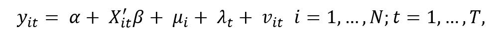
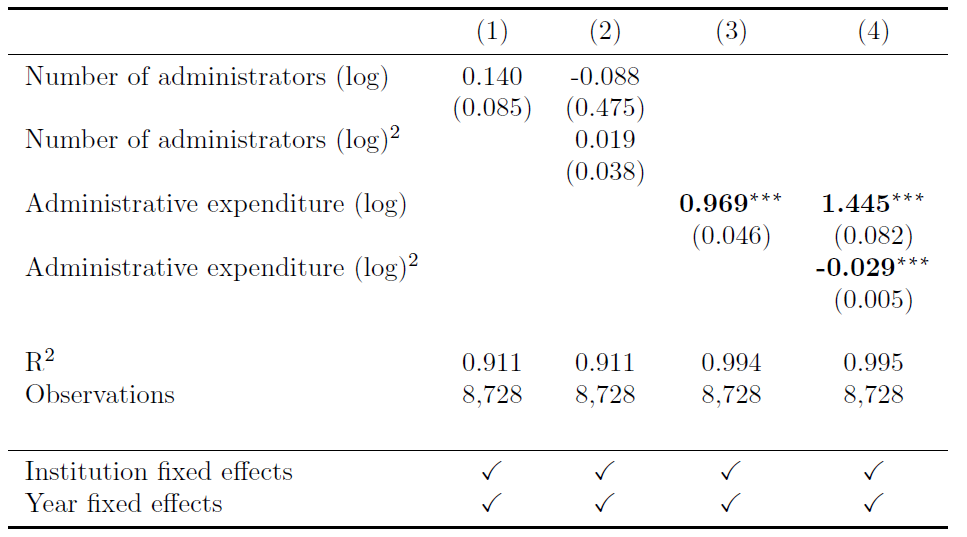
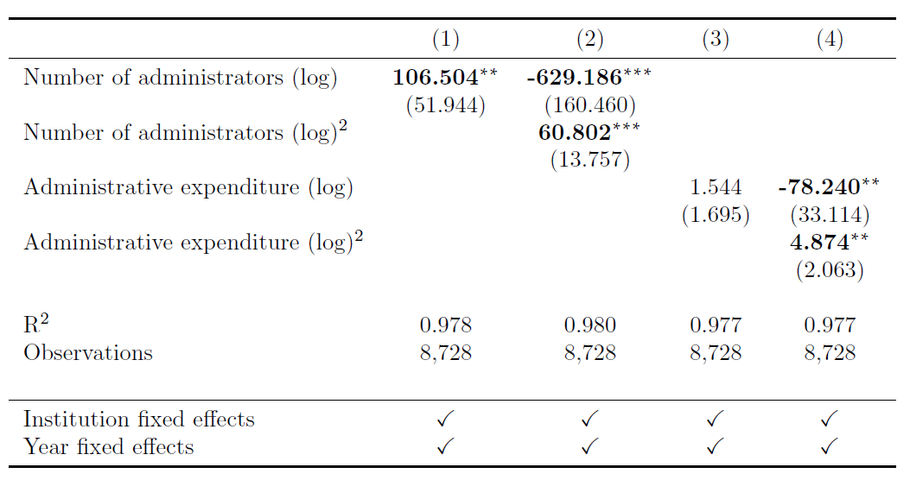
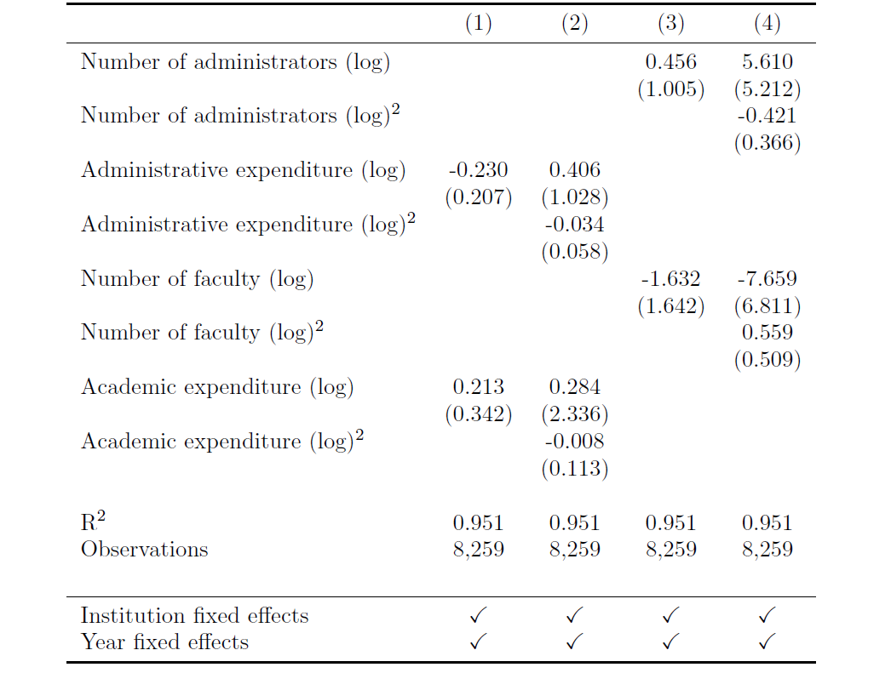
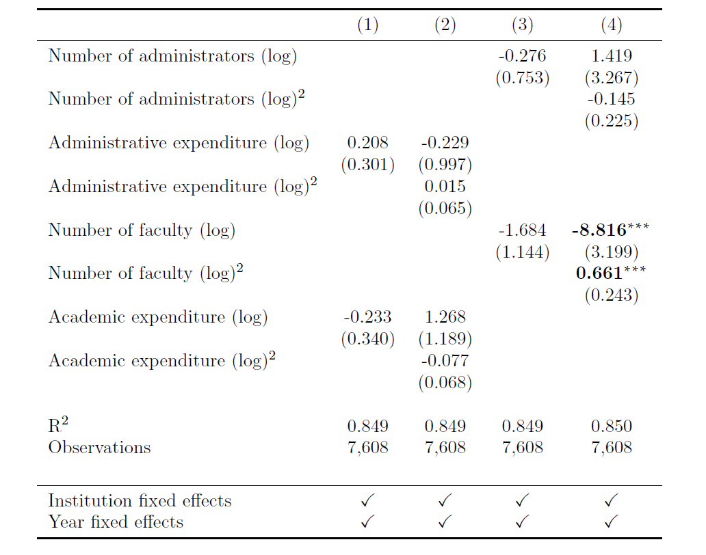
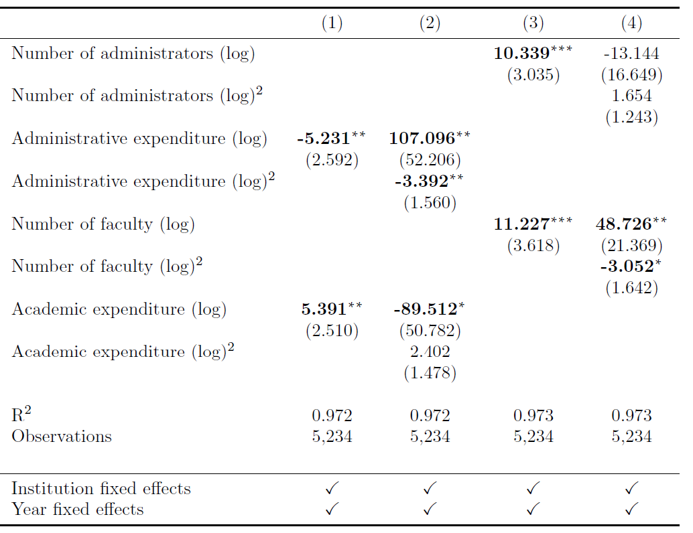
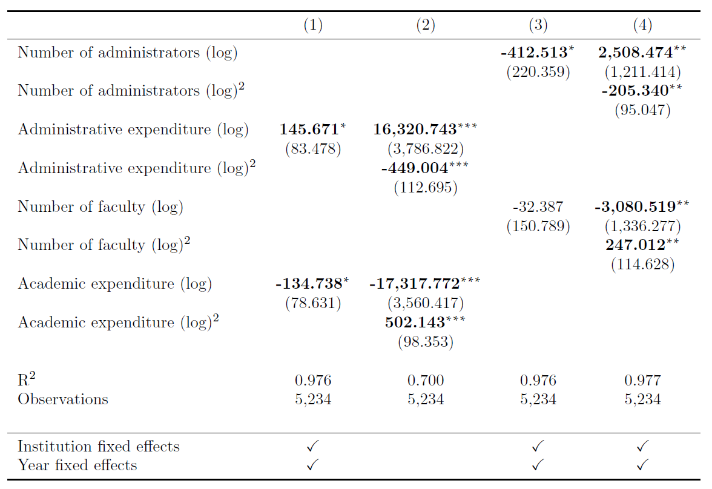

```{r setup, include=FALSE}
options(htmltools.dir.version = FALSE)
knitr::opts_chunk$set(
  fig.width=9, fig.height=3.5, fig.retina=3,
  out.width = "100%",
  cache = FALSE,
  echo = TRUE,
  message = FALSE, 
  warning = FALSE,
  hiline = TRUE
)
```

```{r xaringan-themer, include=FALSE, warning=FALSE}
library(xaringanthemer)
style_mono_accent(
  base_color = "#1c5253",
  header_font_google = google_font("Serif"),
  text_font_google = google_font("Serif"),
  code_font_google = google_font("Fira Mono")
)
```

```{r xaringanExtra, echo = FALSE}
xaringanExtra::use_progress_bar(color = "#1c5253", location = "bottom")

xaringanExtra::use_xaringan_extra(c("tile_view", "animate_css", "tachyons"))
```

```{r xaringan-banner, echo=FALSE}
xaringanExtra::use_banner(
  bottom_left = "Patton College of Education",
  bottom_right = "12/02/2023"
)
```

```{r xaringan-logo, echo=FALSE}
xaringanExtra::use_logo(
  image_url = "https://www.ohio.edu/sites/default/files/2021-10/OHIO_primary_logo_RGB_Cutler.png",
  position = xaringanExtra::css_position(top = "1em", right = "1em")
)
```

```{r xaringan-editable, echo=FALSE}
xaringanExtra::use_editable(expires = 15)
```

```{r include=FALSE}
library(pacman)
p_load(fixest, knitr, kableExtra, tinytex, fontawesome, ggplot2, tidyverse, RColorBrewer, ggtext, skimr, dlookr, flextable, wesanderson)
load("D:/Dissertation/Data and code/Code/disseration_231129_for Slide.RData")
```

### Outline

+ Background

+ Theoretical Framework

+ Literature Review

+ Methodology

+ Data Analysis

+ Preliminary Results

+ Resources

---

```{r, echo = FALSE, fig.align='center'}

```

---
.panelset[
.panel[.panel-name[Institutional expenses]
```{r, echo = FALSE, fig.align='center'}
expenses <- read.csv("D:/Dissertation/Data and code/Code/Slide/trend in expenses.csv")
theme_set(theme_classic(base_family = "serif"))

p <- expenses |>
  mutate(
    Expenses = Expenses/1000
  ) |>
  ggplot(
    aes(
      x = Year, y = Expenses, group = 1
    )
  ) +
  geom_line(
  ) +
  geom_point() +
  labs(
    title = "Expenses of public postsecondary institutions",
    x = "Year",
    y = "Expenses (in millions)",
    caption = "source: IPEDS  •  Adjust for inflation"
  ) + 
  theme(
    plot.background = element_rect(fill = "grey96", color = "grey96"),
    panel.background = element_rect(fill = "grey96", color = "grey96"),
    plot.title = element_text(
      color = "grey10", 
      size = 20, 
      hjust = 0.5,
      face = "bold"
      ),
    plot.caption = element_text(
      color = "grey30",
      lineheight = 1, 
      hjust = 0
      ),
    axis.text.x = element_text(margin = margin(t = 5)),
    axis.text.y = element_text(margin = margin(r = 5)),
    plot.margin = margin(c(15, 10, 30, 10))
  ) +
  scale_x_continuous(
    breaks = seq(2010, 2021, 1)
  ) +
  scale_y_continuous(
    breaks = seq(200000,500000, 100000),
    limits = c(200000, 500000),
    labels = scales::comma
  ) 


p 
```
]

.panel[.panel-name[IPEDS faculty salaries]

```{r, echo = FALSE, fig.align='center'}

```
]

]

---
## Background
-   A dramatic expansion in administrative positions since the late twentieth century in U.S. higher education.

-   Full-time faculty have been replaced by contingent faculty and faculty salary outlay has stayed flat.

-   Debates on administration bloat.

-   Tensions between academic and administrative units.

## Study Purpose
-   Examine the possible trade-off effects between academic and administrative units within U.S. four-year public institutions.

-   The potential impacts of rising administration on institutional performance (student outcomes, faculty productivity).

---
## Reseach Questions
-   How have administrative expenditures been related to investment in faculty (i.e., the amount of faculty, faculty compensation)? To what extent do those relationships exist? 

-   How have such relationships been associated with institutional performance (i.e., student outcomes and research productivity)? 

-   How have such relationships varied across different types of institutions? 

---
## Theoretical Framework
-   Three hypotheses of the relationship between administrative intensity and institutional performance
  -   Contingency theory and resource dependence theory: **Positive**
  
  -   Neo-institutional theory: **Neutral** 
  
  -   Public choice theory: **Negative**

---
## Literature Review
-   Concerns related to rising administration
  -   Administrative bloat
    -   increasing administrative spending, institutional costs, and tuition (Campos, 2015; Mastrodicasa, 2016)
  
  -   Administrative lattice 
    –   “the proliferation and entrenchment of administrative staff” (Massy & Warner, 1991, p.184) 
  
  -   Bureaucratization
    -   academic and administrative bureaucratization (Coccia, 2009)
  
-   Impacts on student outcomes
  -   Debates on whether bureaucracy induces poor performance, otherwise poor performance requires more bureaucracy to make improvements (Chubb & Moe, 1988; Smith & Meier, 1994).
  
  -   Recent studies found administrative level has a curvilinear relationship with organizations’ performance (Boon & Wynen, 2017; Darnley et al., 2019; Rogers, 2012; Ting et al., 2014; Tran & Dollery, 2022).

-   Impacts on faculty
  -   Cooperate to maximize institutional performance.
  
  -   Compete for resources.

-   Heterogeneous effects across institutions

---
## Methodology
-   Panel data analysis

-   Fixed effects model and random effects model
  -   Two-way fixed effects models models with cluster-robust standard errors
```{r, echo = FALSE, fig.align='center'}

```


-   Two stages
  -   First stage examines the potential trade-off effect of increasing administration
  
  -   Second stage explores the possible impacts of expanded administration on institutional performance

-   Packages
  -   [<ins>fixest package</ins>](https://lrberge.github.io/fixest/)<br>
  
  -   [<ins>plm package</ins>](https://cran.r-project.org/web/packages/plm/vignettes/A_plmPackage.html)
  
---
class: scrollable-slide
## Data analysis
+ Define research questions in quantitative way
  -   e.g., How does A impact B

+ Identify key variables and appropriate research method
  -   e.g., dependent variable(s), independent variables, and control variables

+ Data collection
  -   e.g., open data sources (IPEDS), survey

+ **Data clean**
  -   [<ins>tidyverse package</ins>](https://www.tidyverse.org/packages/)
  
+ Data visualization
  -   [<ins>ggplot2 package</ins>](https://r-graph-gallery.com/ggplot2-package.html)
  
  -   Check for distributions, outliers, extreme values, trends, relationships among variables, etc.
  
+ Model building

+ Robustness check and tests
  -   Examine various assumptions

+ Results export
  -   [<ins>stargazer package</ins>](https://cran.r-project.org/web/packages/stargazer/vignettes/stargazer.pdf)
---
### Data Collections

-   Integrated Postsecondary Education Data System (IPEDS)
  -   [<ins>Instruction on downloading IPEDS data</ins>](https://shiyaliu.netlify.app/post/data-download//)
  -   Institutional characteristics
  
  -   Students' characteristics
  
  -   Revenues and expenses

-   Web of Science (WoS)
  -   The number of publications and h index

-   733 4-year U.S. public institutions from 2005 to 2020

---

```{r echo=FALSE}
knitr::include_graphics("key variable.png", dpi = 270)
```

---
### Data clean
```{r echo=FALSE}
knitr::include_graphics("data clean.png", dpi = 270)
```

source: R for Data Science (2e)

---
### Some my code to clean IPEDS data
+ Load IPEDS files 
```{r eval=FALSE}
df <- list.files(
  "path to data", 
  pattern = "*.csv",
  full.names = T) |>
  lapply(read_csv)
```

+ Clean variables' name
  -   e.g., drop prefix and suffix, replace blank and common with underscore
```{r, eval=FALSE}
replacements <- c(" - " = "_",
                  " " = "_",
                  "-" = "_",
                  "/" = "_",
                  "," = "")
for (i in 1:16) {
  df[[i]] <- df[[i]] |>
    setNames(gsub(
      pattern = ".*RV.|.*[0-9]\\.|,.*|:.*",
      replacement = "",
      x= names(df[[i]])
      )
      ) |>
    rename_all(~str_replace_all(.x, replacements))
}
```

+ Calculate variables in multiple files
```{r, eval=FALSE}
for (i in 1:16){
  df[[i]] <- df[[i]] |>
    mutate(
      faculty_salary = rowSums(across(all_of(faculty_salary)),
                             na.rm = TRUE)
}
```

---
### Data visualization
.panelset[
.panel[.panel-name[Academic expenditure]
```{r, echo=FALSE}
custom.col <- c("#006b7b","#ef1828","#f88421","grey",
            "grey8")
my_theme <- theme(
    # Set background color to white
    panel.background = element_rect(fill = "white"),
    # Remove all grid lines
    panel.grid = element_blank(),
    # But add grid lines for the vertical axis, customizing color and size 
    panel.grid.major.y = element_line(color = "#A8BAC4", size = 0.3),
    # Remove tick marks on the vertical axis by setting their length to 0
    axis.ticks.length.y = unit(0, "mm"), 
    # But keep tick marks on horizontal axis
    axis.ticks.length.x = unit(2, "mm"),
    # Only the bottom line of the vertical axis is painted in black
    axis.line.x.bottom = element_line(color = "black"),
    # But customize labels for the horizontal axis
    axis.text.x = element_text(family = "serif", size = 12),
    plot.title = element_markdown(
      family = "serif", 
      size = 16
    ),
    plot.margin = margin(0, 0, 0, 0, "npc"),
    legend.key.size = unit(0.5, 'cm')
  )

p1 <- reg |>
  filter(!institution_category%in%c("Other")) |>
  group_by(institution_category, year) |>
  mutate(
    faculty_salary_mean = mean(faculty_salary)/1000000 
  ) |>
  ungroup() |>
  ggplot(
    aes(y = faculty_salary_mean, x = year, fill = institution_category, color = institution_category)
  ) +
  geom_line(size = 1) +
  geom_point( 
    size = 1.5, 
    pch = 21, # Type of point that allows us to have both color (border) and fill.
    color = "white", 
    stroke = 1 # The width of the border, i.e. stroke.
  ) +
  labs(
    y = "Average academic expenditures (millions)",
    x = "Year",
    title = "Academic Expenditure of Different Types of Institutions",
    color = "Institutional category",
    fill = "Institutional category"
  ) +
  scale_color_manual(values = custom.col) +
  scale_fill_manual(values = custom.col) +
  scale_x_continuous(
    limits = c(2005, 2020),
    breaks = seq(2005, 2020, 1)
  ) +
  scale_y_continuous(
    limits = c(0,400),
    breaks = seq(0, 400, 100)
  ) +
  my_theme
  
p1
```

]

.panel[.panel-name[Academic staff]
```{r, echo=FALSE}
p2 <- reg |>
  filter(!institution_category%in%c("Other")) |>
  group_by(institution_category, year) |>
  mutate(
    num_faculty_mean = mean(num_faculty, na.rm = TRUE)
  ) |>
  ungroup() |>
  ggplot(
    aes(y = num_faculty_mean, x = year, fill = institution_category, color = institution_category)
  ) +
  geom_line(size = 1) +
  geom_point( 
    size = 1.5, 
    pch = 21, # Type of point that allows us to have both color (border) and fill.
    color = "white", 
    stroke = 1 # The width of the border, i.e. stroke.
  ) +
  labs(
    y = "Average academic staff",
    x = "Year",
    title = "Academic Staff of Different Types of Institutions",
    color = "Institutional category",
    fill = "Institutional category"
  ) +
  scale_color_manual(values = custom.col) +
  scale_fill_manual(values = custom.col) +
  scale_x_continuous(
    limits = c(2005, 2020),
    breaks = seq(2005, 2020, 1)
  ) +
  my_theme
  
p2
```
]

]

---
### Practical tools

.panelset[
.panel[.panel-name[summary]
```{r, echo=FALSE}
key_cols <- c(
  "unitid"                      , "institution_name",
  "institution_category"        ,
  "year"                        , "state",
  "faculty_salary"              , "staff_salary",
  "staff_num"                   , "num_faculty",
  "staff_num_ln"                , "num_faculty_ln",
  "admin_exp_ln"                , "faculty_exp_ln",
  "pcnt_enroll_women"           , "ACT_total_25",
  "ACT_total_75"                , "Pell",
  "pcnt_White_faculty"          , "pcnt_men_faculty",
  "retention_rate"              ,
  "graduation_rate"              , "fte_ln",
  "tuition_ln"                  , "approp_ln",
  "sales_ln"                    , "gifts_ln",
  "h_index"                     , "wos_docs"
)

data <- reg |>
  select(all_of(key_cols))
```

```{r}
summary(data)
```

]

.panel[.panel-name[diagnose & flextable]
```{r}
diagnose(data) |>
  flextable()
```
]

.panel[.panel-name[skim]
```{r}
skim(data)
```

]

]
---
### Model building
```{r}
# Set dictionary relabeling the variables
setFixest_dict(
  c(
    admin_exp_ln = "Administrative expenditure (log)",
    admin_exp_ln2 = "$Administrative expenditure (log)^2$",
    staff_num_ln = "Number of administrators (log)",
    staff_num_ln2 = "$Number of administrators (log)^2$",
    faculty_exp_ln = "Academic expenditure (log)",
    faculty_exp_ln2 = "$Academic expenditure (log)^2$",
    num_faculty_ln = "Number of faculty (log)",
    num_faculty_ln2 = "$Number of faculty (log)^2$",
    pcnt_men_faculty = "Men faculty (%)",
    pcnt_White_faculty = "White faculty (%)",
    fte_ln = "Full-time equivalent student (log)",
    tuition_ln = "Tuition (log)",
    approp_ln = "Appropriations (log)",
    sales_ln = "Sale (log)",
    gifts_ln = "Gift (log)",
    pcnt_enroll_Black = "Black or African student (%)",
    pcnt_enroll_Hispanic = "Hispanic or Latino student (%)",
    pcnt_enroll_women = "Women student (%)",
    Pell = "Students award Pell Grants",
    ACT_total_25 = "25th percentile ACT score",
    ACT_total_75 = "75th percentile ACT score",
    year = "Year",
    unitid = "Institution"
  )
)

# Set formula
f1 <- as.formula(
  faculty_exp_ln ~
    staff_num_ln +
    pcnt_men_faculty +
    pcnt_White_faculty +
    fte_ln +
    tuition_ln +
    approp_ln +
    sales_ln +
    gifts_ln + 
    pcnt_enroll_Black +
    pcnt_enroll_Hispanic +
    pcnt_enroll_women +
    Pell|unitid + year
)

# Build model with clustered robust standard errors
fix1 <- feols(f1, data = reg, 
              panel.id = c("unitid", "year"), 
              cluster = ~ state # clustering standard errors
              )

# Show results
summary(fix1)
```

---
### Robustness check and tests
-   Hausman test

  -   This test is used to choose between the fixed and the random effects models.

  -   The null hypothesis is that the preferred model is random effects vs. the alternative the fixed effects.


```{r eval=FALSE}
phtest(fixed, random)
```

-   Tests of poolability

  -   Poolability: the same coefficients apply across all individuals.
```{r eval=FALSE}
pooltest(f1, data = pData, model = "within")
```

-   Tests for individual and time effects

  -   It implements Lagrange multiplier tests of individual or/and time effects based on the results of pooling model. 

  -   The null hypothesis is that no two-way fixed effects needed. 
```{r eval=FALSE}
plmtest(pool, effect = "twoways", type = "ghm")
```

---
## Preliminary Results

```{r xaringan-panelset, echo=FALSE}
xaringanExtra::use_panelset()
```
.panelset[
.panel[.panel-name[Academic expenditure]
```{r, echo = FALSE, out.height="50%", fig.height=1, out.width="50%", fig.align='center'}

```
]

.panel[.panel-name[Number of faculty]

```{r, echo = FALSE, out.height="50%", fig.height=1, out.width="50%", fig.align='center'}

```
]

.panel[.panel-name[Graduation rate]

```{r, echo = FALSE, out.height="50%", fig.height=1, out.width="50%", fig.align='center'}

```
]

.panel[.panel-name[Retention rate]

```{r, echo = FALSE, out.height="50%", fig.height=1, out.width="50%", fig.align='center'}

```
]

.panel[.panel-name[Research quality]

```{r, echo = FALSE, out.height="50%", fig.height=1, out.width="50%", fig.align='center'}

```
]
.panel[.panel-name[Research quantity]

```{r, echo = FALSE, out.height="50%", fig.height=1, out.width="50%", fig.align='center'}

```
]
]

---
## Some tips
`r fa(name = "exclamation", fill = "red", height = "1em")` `r fa(name = "exclamation", fill = "red", height = "1em")` `r fa(name = "exclamation", fill = "red", height = "1em")` Keep learning

`r fa(name = "exclamation", fill = "red", height = "1em")` `r fa(name = "exclamation", fill = "red", height = "1em")` Write data analysis journey
`r fa(name = "exclamation", fill = "red", height = "1em")` Always save your code and data

+ Understand variables' definition and changes in annual surveys

+ Clean workspace before starting

+ Organize your code and your files

+ Using Google to search your questions

+ Figure out your questions

+ The most important thing is to achieve your goals. It does no matter how you write your code

+ Come with your friends and support systems
  -   [<ins>r4ds learning community</ins>](https://rfordatasci.com/), [<ins>r-ladies</ins>](https://rladies.org/)...


---
## Resouces
👉 [<ins>**Introduction to panel data and plm package**</ins>](https://cran.r-project.org/web/packages/plm/vignettes/A_plmPackage.html)<br>

👉 [<ins>**Introduction to fixest package**</ins>](https://lrberge.github.io/fixest/)<br>

👉 [<ins>**A book for rmarkdown**</ins>](https://bookdown.org/yihui/rmarkdown/)<br>

👉 [<ins>**R for data science (2e)**</ins>](https://r4ds.hadley.nz/)<br>


👉 [<ins>**stargazer package**</ins>](https://cran.r-project.org/web/packages/stargazer/vignettes/stargazer.pdf)<br>

👉 [<ins>**skimr package**</ins>](https://cran.r-project.org/web/packages/skimr/vignettes/skimr.html)<br>

👉 [<ins>**Official website of ggplot2 package**</ins>](https://ggplot2.tidyverse.org/)<br>

[<ins>**My personal website**</ins>](https://shiyaliu.netlify.app/)<br>


---
class: center, middle

# Thanks!

Slides created via the R packages:

[**xaringan**](https://github.com/yihui/xaringan)<br>
[gadenbuie/xaringanExtra](https://github.com/gadenbuie/xaringanExtra)

The chakra comes from [remark.js](https://remarkjs.com), [**knitr**](http://yihui.name/knitr), and [R Markdown](https://rmarkdown.rstudio.com).
